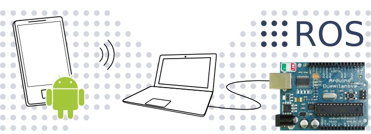

ROS Demo: Android to Arduino
============================

A demonstration [ROS][ros] node in Python to connect an Android device with an Arduino board.

  [ros]: http://www.ros.org
  [tutorial]: http://wiki.ros.org/android_sensors_driver/Tutorials/DrivingAnArduinoBoardFromAnAndroidDevice

Tutorial
--------

Tutorials in the ROS Wiki use to describe line-by-line what the example code does and to explain why. So does the tutorial which describes this ROS package: see [DrivingAnArduinoBoardFromAnAndroidDevice][tutorial] at the [ROS Wiki][wiki].

  [wiki]: http://wiki.ros.org

Credits
-------

The [ROS][ros-credit], [Arduino][arduino-credit] and [Android][android-credit] logos and pictures are propiety of their authors, please follow the links for details about their respective copyrights and licenses. 

  [ros-credit]: http://www.ros.org/_wiki/images/ros_org.png
  [android-credit]:  http://en.wikipedia.org/wiki/File:Android_robot.svg
  [arduino-credit]: http://en.wikipedia.org/wiki/File:Arduino_Duemilanove_2009b.jpg

License
-------

    An Android to Arduino ROS package.
    Copyright (C) 2012 Gonzalo Bulnes Guilpain

    This program is free software: you can redistribute it and/or modify
    it under the terms of the GNU General Public License as published by
    the Free Software Foundation, either version 3 of the License, or
    (at your option) any later version.

    This program is distributed in the hope that it will be useful,
    but WITHOUT ANY WARRANTY; without even the implied warranty of
    MERCHANTABILITY or FITNESS FOR A PARTICULAR PURPOSE.  See the
    GNU General Public License for more details.

    You should have received a copy of the GNU General Public License
    along with this program.  If not, see <http://www.gnu.org/licenses/>.

